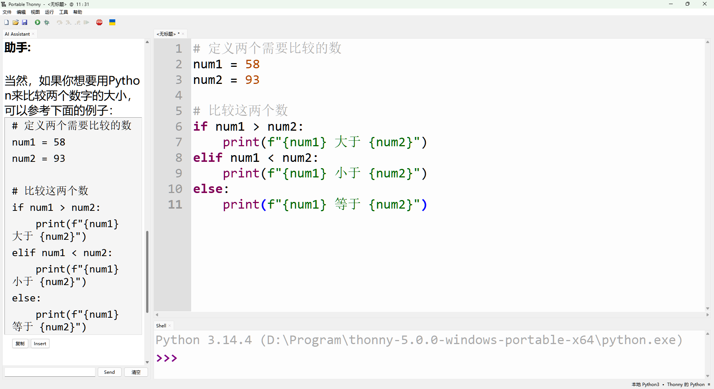

# thonny‑ai‑helper AI助手调整字体大小 / thonny‑ai‑helper AI Assistant adjust the font size
[English](#english) | [中文](#chinese)

---

### 项目简介
用于Thonny的thonny‑ai‑helper插件增加Ctrl+鼠标滚轮可缩放AI助手的字体大小的功能。代码由豆包（字节跳动 Seed 大模型）辅助生成，由开发者手动调试、整合、优化并开源发布。

### 使用方法
1. 安装[Python](https://www.python.org/downloads/)
2. 打开[LM Studio](https://lmstudio.ai/download)并开启本地API服务
3. 打开[Thonny](https://thonny.org/)，点击工具-管理插件搜索安装thonny-ai-helper，点击视图开启AI Assistant
4. 将`patch_ai_helper.py`文件放到thonny-5.0.0-windows-portable-x64\user_data\plugins\Python314\site-packages\thonnycontrib\ai_helper，ai_helper.py文件所在文件夹里，双击运行直到出现ai_helper.py.bak，重启Thonny
5. Ctrl+鼠标滚轮可缩放AI助手的字体大小

[视频演示](https://www.bilibili.com/video/BV13YhD6rEmh)
---

### Project Introduction
The thonny‑ai‑helper plug-in for Thonny adds the ability of Ctrl+ mouse wheel to zoom the font size of the AI Assistant.GUI and code of this project are assisted by Doubao (ByteDance Seed LLM), manually debugged, integrated, optimized and open-sourced by the developer.

### Usage
1. Install [Python](https://www.python.org/downloads/) 
2. Open [LM Studio](https://lmstudio.ai/download) and open local API services
3. Open [Thonny](https://thonny.org/), click Tools-Management Plug-in Search and install thonny-ai-helper, click View to open AI Assistant
4. Put the `patch_ai_helper.py` file into the folder where thonny-5.0.0-windows-portable-x64\user_data\plugins\Python314\site-packages\thonnycontrib\ai_helper, where the ai_helper.py file is located, double click and run until ai_helper. py.bak appears, and restart Thonny
5. Ctrl+ mouse wheel can zoom the font size of the AI Assistant

[Video Demonstration](https://www.bilibili.com/video/BV13YhD6rEmh)
